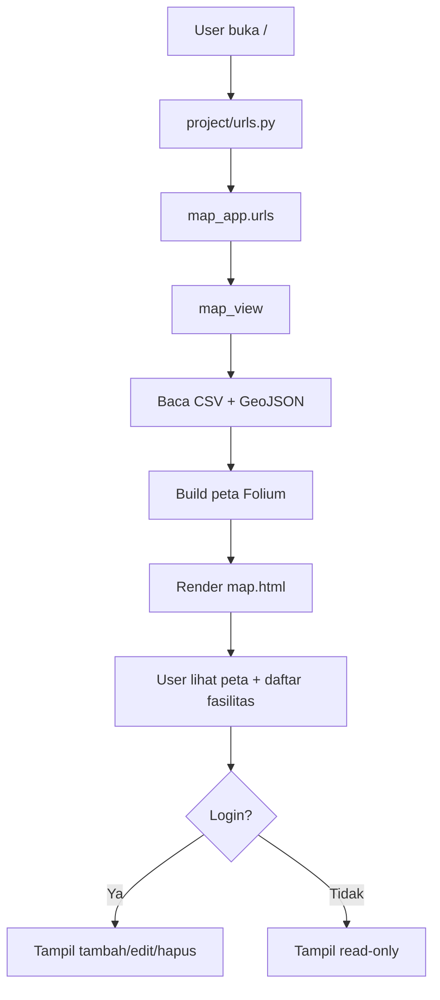
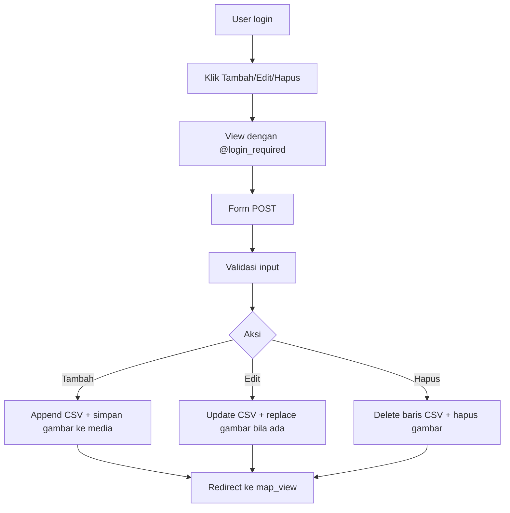

# Dokumentasi Analisis Sistem Django GIS

## 1. Ringkasan Project

Project ini aplikasi Django untuk GIS sederhana. Fokus utama: tampilkan titik fasilitas umum Pekanbaru di peta Folium, sediakan pencarian, login/register, lalu CRUD koordinat untuk user yang sudah login. Entry project ada di `manage.py` [manage.py](/mnt/d/Kuliah/Semester%205/SIG/project_/project_folder/manage.py:1), konfigurasi di `project/settings.py` [settings.py](/mnt/d/Kuliah/Semester%205/SIG/project_/project_folder/project/settings.py:34), routing di `project/urls.py` [urls.py](/mnt/d/Kuliah/Semester%205/SIG/project_/project_folder/project/urls.py:6).

## 2. Tujuan Sistem

Tujuan sistem:

1. Tampilkan peta interaktif fasilitas umum.
2. Kelompokkan fasilitas per kategori.
3. Sediakan layer wilayah administrasi via GeoJSON.
4. Izinkan tambah, edit, hapus koordinat.
5. Batasi CRUD hanya untuk user login.

## 3. Struktur Folder dan Fungsinya

- `project/`: konfigurasi inti Django. Isi `settings.py`, `urls.py`, `wsgi.py`, `asgi.py`.
- `map_app/`: aplikasi utama. Isi model, view, URL app, admin, migration, template.
- `data/`: data sumber. Di sini ada CSV koordinat, file GeoJSON wilayah, dan foto referensi.
- `media/`: tempat file upload dari user. Di kode, gambar disimpan ke `media/images/`.
- `templates/`: pada project ini template ada di dalam app: `map_app/templates/map_app/`.
- `db.sqlite3`: database SQLite. Dipakai Django auth, session, dan tabel model `Coordinate`.
- `env/`: virtual environment Python.

## 4. Teknologi yang Digunakan

- Django 5.1.x
- SQLite
- pandas untuk baca/tulis CSV
- Folium untuk peta interaktif
- Django auth untuk login/register
- HTML, CSS, JavaScript
- Tailwind, Font Awesome, AOS, Animate.css di template

Catatan: GIS di sini bukan GeoDjango. GIS-nya dibangun lewat Folium + GeoJSON, bukan field spasial database.

## 5. Alur Sistem Secara Umum

Alur inti:

1. User buka root `/`.
2. `project/urls.py` meneruskan ke `map_app.urls`.
3. `map_view` baca data CSV, filter jika ada search, lalu bangun peta Folium.
4. Template `map.html` tampilkan peta dan daftar fasilitas.
5. Jika user login, tombol tambah/edit/hapus muncul.
6. Data perubahan disimpan ke CSV, bukan ke tabel model Django.

## 6. Alur Login dan Register

### Login

- URL: `/login/`
- View: `login_view` [views.py:440-459](/mnt/d/Kuliah/Semester%205/SIG/project_/project_folder/map_app/views.py:440)
- Template: `login.html` [login.html:23-49](/mnt/d/Kuliah/Semester%205/SIG/project_/project_folder/map_app/templates/map_app/login.html:23)

Alur:

1. User isi username dan password.
2. `authenticate()` cek ke tabel `auth_user`.
3. Jika valid, `login()` dipanggil.
4. User diarahkan ke `map_view`.
5. Jika gagal, view kirim `messages.error()`.

### Register

- URL: `/register/`
- View: `register_view` [views.py:477-503](/mnt/d/Kuliah/Semester%205/SIG/project_/project_folder/map_app/views.py:477)
- Template: `register.html` [register.html:23-77](/mnt/d/Kuliah/Semester%205/SIG/project_/project_folder/map_app/templates/map_app/register.html:23)

Alur:

1. User isi username, email, password, dan konfirmasi password.
2. View cek password cocok.
3. View cek username sudah ada atau belum.
4. `User.objects.create_user()` simpan user ke database SQLite.
5. User diarahkan ke halaman login.

## 7. Alur Halaman Map

- URL: `/`
- View: `map_view` [views.py:54-252](/mnt/d/Kuliah/Semester%205/SIG/project_/project_folder/map_app/views.py:54)
- Template: `map.html` [map.html:563-653](/mnt/d/Kuliah/Semester%205/SIG/project_/project_folder/map_app/templates/map_app/map.html:563)

Alur:

1. Peta dasar dibuat dengan `folium.Map()`.
2. Data dibaca dari `data/data_titik_pekanbaru.csv`.
3. Jika ada query `search`, data difilter berdasarkan `Nama` dan `Kategori`.
4. Data diubah jadi list of dict.
5. Setiap kategori dibuat jadi `FeatureGroup`.
6. Marker dibuat per baris, lengkap dengan popup dan ikon sesuai kategori.
7. File GeoJSON wilayah juga dibaca dan ditaruh sebagai layer.
8. `map_pku._repr_html_()` dikirim ke template.
9. Template tampilkan:
   - peta
   - daftar fasilitas
   - tombol login/logout
   - tombol tambah/edit/hapus jika user login

## 8. Alur CRUD Koordinat

### Tambah

- URL: `/add/`
- View: `add_coordinate` [views.py:261-320](/mnt/d/Kuliah/Semester%205/SIG/project_/project_folder/map_app/views.py:261)
- Template: `add_coordinate.html` [add_coordinate.html:240-340](/mnt/d/Kuliah/Semester%205/SIG/project_/project_folder/map_app/templates/map_app/add_coordinate.html:240)

Alur:

1. Hanya user login bisa akses, karena `@login_required`.
2. Form kirim data POST.
3. View validasi field wajib dan angka latitude/longitude.
4. Jika ada gambar, file disimpan ke `media/images/`.
5. ID baru dihitung dari CSV terakhir + 1.
6. Baris baru di-append ke `data/data_titik_pekanbaru.csv`.
7. Redirect ke `map_view`.

### Edit

- URL: `/edit/<id>/`
- View: `edit_coordinate` [views.py:329-391](/mnt/d/Kuliah/Semester%205/SIG/project_/project_folder/map_app/views.py:329)
- Template: `edit_coordinate.html` [edit_coordinate.html:204-254](/mnt/d/Kuliah/Semester%205/SIG/project_/project_folder/map_app/templates/map_app/edit_coordinate.html:204)

Alur:

1. Hanya user login bisa akses.
2. View baca CSV dan cari baris sesuai `ID`.
3. Form tampil dengan data lama.
4. Saat POST, field diperbarui.
5. Jika ada gambar baru, gambar lama dihapus dari `media`, lalu gambar baru disimpan.
6. CSV ditulis ulang.
7. Redirect ke `map_view`.

### Hapus

- URL: `/delete/<id>/`
- View: `delete_coordinate` [views.py:400-433](/mnt/d/Kuliah/Semester%205/SIG/project_/project_folder/map_app/views.py:400)
- Template: `delete_coordinate.html` [delete_coordinate.html:240-256](/mnt/d/Kuliah/Semester%205/SIG/project_/project_folder/map_app/templates/map_app/delete_coordinate.html:240)

Alur:

1. Hanya user login bisa akses.
2. GET tampilkan halaman konfirmasi.
3. POST hapus baris CSV sesuai `ID`.
4. Jika ada gambar, file gambar juga dihapus dari `media`.
5. Redirect ke `map_view`.

## 9. Analisis Model Database

Model ada di [models.py:3-10](/mnt/d/Kuliah/Semester%205/SIG/project_/project_folder/map_app/models.py:3):

```python
class Coordinate(models.Model):
    nama = models.CharField(max_length=255)
    kategori = models.CharField(max_length=100)
    latitude = models.FloatField()
    longitude = models.FloatField()
```

Makna field:

- `nama`: nama lokasi
- `kategori`: jenis fasilitas
- `latitude` dan `longitude`: titik koordinat

Masalah utama:

- Model ini memang ada di Django ORM.
- Migration juga membuat tabel `map_app_coordinate`.
- Tapi view CRUD tidak pakai `Coordinate.objects...`.
- Implementasi nyata simpan-baca data pakai CSV `data/data_titik_pekanbaru.csv`.

Jadi, ada dua lapis penyimpanan:

1. SQLite table `map_app_coordinate` dari model.
2. CSV sebagai sumber data aktif untuk peta.

Itu mismatch desain. Data koordinat belum benar-benar jalan lewat ORM.

## 10. Analisis Migration

Migration awal ada di [0001_initial.py:1-24](/mnt/d/Kuliah/Semester%205/SIG/project_/project_folder/map_app/migrations/0001_initial.py:1)

Isi:

- `initial = True`
- dependency kosong
- `CreateModel` untuk `Coordinate`

Efek:

- Django membuat tabel `map_app_coordinate`
- Kolom: `id`, `nama`, `kategori`, `latitude`, `longitude`

Catatan:

- Migration hanya bikin struktur tabel.
- Tidak ada data seed.
- Tidak ada migration lanjutan yang menghubungkan model ke flow CSV.

## 11. Analisis Views

| Nama View             | Fungsi                                                       | URL               | Template                   | Proses Database                         |
| --------------------- | ------------------------------------------------------------ | ----------------- | -------------------------- | --------------------------------------- |
| `map_view`          | Tampil peta, search, daftar fasilitas, marker, layer GeoJSON | `/`             | `map.html`               | Baca CSV, tidak tulis DB                |
| `add_coordinate`    | Tambah koordinat baru                                        | `/add/`         | `add_coordinate.html`    | Append CSV, simpan gambar ke `media/` |
| `edit_coordinate`   | Edit koordinat existing                                      | `/edit/<id>/`   | `edit_coordinate.html`   | Baca/tulis ulang CSV, update gambar     |
| `delete_coordinate` | Hapus koordinat                                              | `/delete/<id>/` | `delete_coordinate.html` | Hapus baris CSV, hapus file gambar      |
| `login_view`        | Login user                                                   | `/login/`       | `login.html`             | Cek `auth_user` lewat auth Django     |
| `logout_view`       | Logout user                                                  | `/logout/`      | Tidak pakai template       | Update session auth                     |
| `register_view`     | Register user baru                                           | `/register/`    | `register.html`          | Insert ke `auth_user`                 |
| `about_pekanbaru`   | Tampil halaman info Pekanbaru                                | `/about/`       | `about.html`             | Tidak ada proses DB                     |

Referensi utama:

- [views.py](/mnt/d/Kuliah/Semester%205/SIG/project_/project_folder/map_app/views.py:54)

## 12. Analisis URL Routing

### `project/urls.py`

- Root `/` diarahkan ke `map_app.urls`.
- `/admin/` ke admin Django.
- Saat `DEBUG=True`, file media diserve lewat `static()`.

Referensi: [project/urls.py:6-13](/mnt/d/Kuliah/Semester%205/SIG/project_/project_folder/project/urls.py:6)

### `map_app/urls.py`

Route detail:

- `''` -> `map_view`
- `add/` -> `add_coordinate`
- `edit/<int:id>/` -> `edit_coordinate`
- `delete/<int:id>/` -> `delete_coordinate`
- `login/` -> `login_view`
- `logout/` -> `logout_view`
- `register/` -> `register_view`
- `about/` -> `about_pekanbaru`

Referensi: [map_app/urls.py:6-20](/mnt/d/Kuliah/Semester%205/SIG/project_/project_folder/map_app/urls.py:6)

Hubungan-nya simpel:
`project/urls.py` = pintu utama
`map_app/urls.py` = daftar route fitur app

## 13. Analisis Template HTML

| Template                   | Fungsi                 | Data yang Ditampilkan                                               | Action/Form                                   |
| -------------------------- | ---------------------- | ------------------------------------------------------------------- | --------------------------------------------- |
| `map.html`               | Halaman utama peta     | `map`, `data_grouped`, `search_query`, `user_authenticated` | GET search, link add/edit/delete/login/logout |
| `add_coordinate.html`    | Form tambah data       | Input kosong / default                                              | POST multipart upload gambar                  |
| `edit_coordinate.html`   | Form edit data         | `row` data lama                                                   | POST multipart upload gambar                  |
| `delete_coordinate.html` | Konfirmasi hapus       | Nama lokasi yang akan dihapus                                       | POST hapus data                               |
| `login.html`             | Form login             | Tidak ada data DB langsung                                          | POST username/password                        |
| `register.html`          | Form register          | Tidak ada data DB langsung                                          | POST username/email/password                  |
| `about.html`             | Halaman info Pekanbaru | Konten statis sejarah dan galeri                                    | Tidak ada form utama                          |

Catatan penting dari template:

- `map.html` pakai `{{ map|safe }}` untuk menampilkan HTML Folium [map.html:605-606](/mnt/d/Kuliah/Semester%205/SIG/project_/project_folder/map_app/templates/map_app/map.html:605)
- `add_coordinate.html` punya mismatch variable `coordinate` dan `row` [add_coordinate.html:244-275](/mnt/d/Kuliah/Semester%205/SIG/project_/project_folder/map_app/templates/map_app/add_coordinate.html:244)
- `add_coordinate.html` juga punya error JS di `particle.style.left = ${x}px;` [add_coordinate.html:295-300](/mnt/d/Kuliah/Semester%205/SIG/project_/project_folder/map_app/templates/map_app/add_coordinate.html:295)
- `delete_coordinate.html` pakai `{{ coordinate.nama }}`, tapi view kirim `row`, jadi teks konfirmasi bisa kosong [delete_coordinate.html:247](/mnt/d/Kuliah/Semester%205/SIG/project_/project_folder/map_app/templates/map_app/delete_coordinate.html:247)
- `about.html` isi statis, bukan bagian CRUD [about.html:31-80](/mnt/d/Kuliah/Semester%205/SIG/project_/project_folder/map_app/templates/map_app/about.html:31)

## 14. Diagram Mermaid

### Diagram alur umum sistem



### Diagram CRUD koordinat



### Diagram URL → View → Template → Database

```mermaid
flowchart LR
    U[URL] --> V[View]
    V --> T[Template]
    V --> S[(CSV / SQLite / Media)]
    T --> B[Browser]
    B --> U

    U1[/login/] --> V1[login_view]
    U2[/register/] --> V2[register_view]
    U3[/] --> V3[map_view]
    U4[/add/ /edit/ /delete/] --> V4[CRUD views]
```

## 15. Kesimpulan Cara Kerja Sistem

Sistem ini bekerja seperti ini: user masuk ke root, `map_view` baca CSV lalu bangun peta Folium. Data koordinat dan gambar aktual disimpan lewat file CSV + `media`, sedangkan SQLite dipakai untuk user auth, session, dan tabel model `Coordinate` yang sekarang belum dipakai di flow utama. Jadi, sistem jalan, tapi struktur penyimpanan belum konsisten antara ORM Django dan implementasi file-based.

## 16. Saran Perbaikan Project

1. Pakai satu sumber data saja. Lebih rapi kalau CRUD pindah ke model `Coordinate` dan `db.sqlite3`, bukan CSV.
2. Daftarkan `Coordinate` di `admin.py` supaya bisa kelola data dari admin Django.
3. Perbaiki template mismatch:
   - `add_coordinate.html` pakai variabel yang belum ada.
   - `delete_coordinate.html` pakai `coordinate.nama`, padahal view kirim `row`.
4. Perbaiki error JavaScript di `add_coordinate.html` pada `particle.style.left = ${x}px;`.
5. Render `messages` di template login/register supaya error sukses terlihat user.
6. Ganti link hardcoded `/about` jadi ``.
7. Hapus dead code seperti assign `GEOJSON_FILE_PATH` berulang dan import duplikat `render`.
8. Jangan simpan `SECRET_KEY` nyata di repository kalau project mau dipakai di luar lokal.
9. Kalau targetnya benar-benar GIS, pertimbangkan GeoDjango atau PostGIS untuk data spasial yang lebih benar.

Saya bisa lanjut bedah file per file lagi kalau perlu, misalnya bikin versi dokumentasi yang lebih formal untuk langsung masuk laporan atau slide presentasi.
